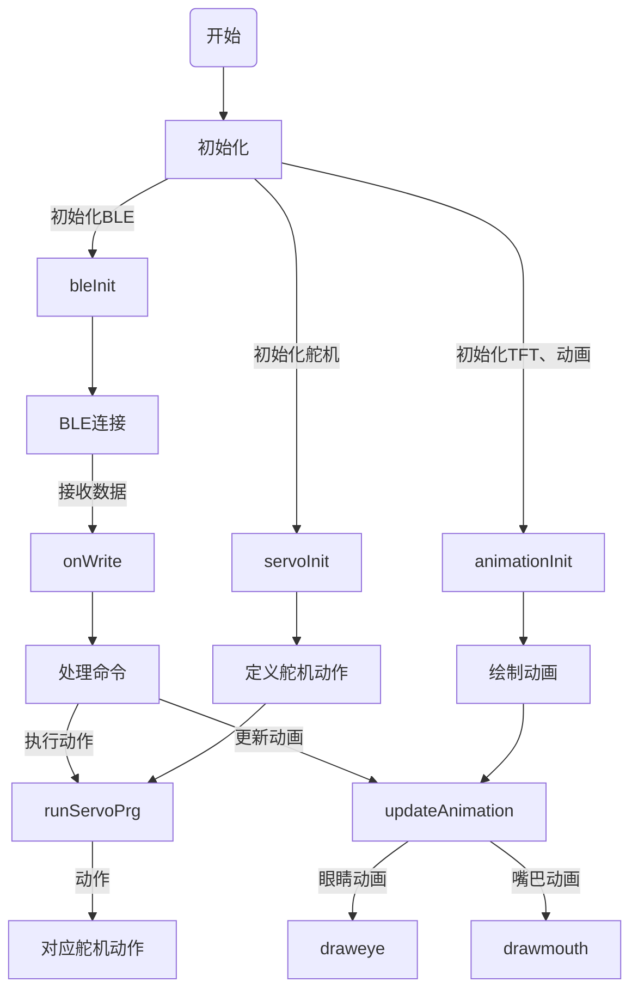

## 项目简介

### 背景
在当今快速发展的科技时代，机器人技术已成为机械工程和电子工程领域中的一个重要分支。高端装备制造业是强国之基，为加快发展新质生产力、落实制造强国战略、建设现代化产业体系提供重要支撑。机器人是人工智能技术与制造业实体经济深度融合的重要领域，工业机器人被誉为“制造业皇冠上的明珠”，在推动制造业生产力水平跃升、推动加快工业新质生产力发展中扮演重要角色。随着智能化、自动化的趋势日益显著，机器人的设计和制造越来越能够体现一个国家在高科技领域的研发实力。

###  选题意义
选择立创开源广场的机器人模块作为复刻对象，是因为该项目不仅提供了完整的开源资料，包括硬件设计文件、软件代码以及3D打印模型，且其设计思路较为清晰。通过本项目的复刻，可以加深对课程所学内容：SOLIDWORKS三维建模设计、3D打印（FDM）、机器人基础知识及电子电路设计等技术的理解，同时通过动手从头完成一部机器人的设计、制作，充分在实践中锻炼解决实际工程问题的能力。

### 项目目标
- 进一步理解并初步掌握机器人的机械设计和电子电路设计等。
- 学习并应用编程语言对机器人进行控制。
- 通过三维建模软件完成机器人结构的设计。利用3D打印技术，获取四足机器人的结构零件。
- 完成机器人的组装、调试，并进行功能测试。
- 撰写一份详细的实习报告，记录整个项目的实施过程、学习心得和遇到的问题及其解决方案。

###  预期成果
预期通过本项目，能够实现：

- 一个功能完备、控制灵活的小型四足机器人。
- 该机器人应能够通过编程实现基本的运动控制，如前进、后退、转向等，并能够通过蓝牙进行远程操控。

## 工作日志

### 第一周

**任务**: 项目需求分析和资料收集

**进展**: 
- 收集并阅读了与ESP32C3开发板相关的技术资料，包括开发板手册、示例项目和技术博客，全面了解其功能和应用。
- 分析了项目需求，明确了机器人的功能定位和设计目标。
- 制定了初步的项目计划，确定了每周的工作目标和里程碑。
- 进行了市场调研，参考了其他类似项目的设计和实现方法，为项目设计提供了参考。

### 第二周

**任务**: 设计机械结构和电路原理图

**进展**: 
- 绘制了机器人的机械结构草图，初步确定了机械部件的布局和尺寸。
- 使用SolidWorks进行三维建模，完成了机器人机械结构的详细设计。
- 在设计过程中，考虑了机器人运动的稳定性和部件的可维护性，优化了机械结构。
- 绘制了详细的电路原理图，选择了适合项目需求的电子元件，并制作了元件清单。
- 对电路设计进行了多次验证，确保电路方案的可行性和可靠性。

### 第三周

**任务**: 硬件组装和电路焊接

**进展**: 
- 按照设计图纸，完成了机械部件的加工和组装，确保各部件之间的配合紧密。
- 使用3D打印技术制作了机械部件，提高了机械结构的精度和美观度。
- 进行了电路板的焊接工作，确保焊点牢固且无虚焊现象。
- 逐一测试了电路的各个部分，确保所有电路连接正常。
- 发现并修复了几个小故障，进一步完善了硬件部分的设计和实现。

### 第四周

**任务**: 编写和调试控制程序

**进展**: 

- 使用Arduino IDE复刻编写了机器人控制程序，主要包括运动控制、屏幕显示和蓝牙通信等功能。
- 调试了蓝牙遥控功能，实现了通过微信小程序对机器人的远程控制。
- 对控制程序进行了多次优化，提高了程序的运行效率和稳定性。
- 进行了多轮测试和调整，确保机器人能够按照预定指令进行精确的动作控制。
- 根据测试结果，修正了程序中的一些逻辑错误，进一步提升了机器人的功能表现。

## 设计文档

### 硬件部分

硬件部分使用嘉立创EDA进行设计。采用合宙 ESP32-C3 作为主控，使用TFT屏幕进行显示，配有。

#### 原理图


#### PCB设计


### BOM

|      | 名称                        | 型号                                  | 封装                                 | 数量 |
| ---- | --------------------------- | ------------------------------------- | ------------------------------------ | ---- |
| 1    | LED1,LED2                   | WS2812B-2020                          | LED-SMD_4P-L2.0-W2.0-TL_WS2812B-2020 | 2    |
| 2    | Q1                          | AO3401-SOT23                          | SOT-23_L2.9-W1.3-P1.90-LS2.4-BR      | 1    |
| 3    | R5,R1                       | 10k                                   | R0603                                | 2    |
| 4    | C1                          | 100nF                                 | C0603                                | 1    |
| 5    | TFT0                        | FPC 0.5MM 8P Pull type H2.0mm Pick up | FPC-SMD_AFC07-S08ECC-00              | 1    |
| 6    | R4                          | 33k                                   | R0603                                | 1    |
| 7    | C4                          | 10uf                                  | C0603                                | 1    |
| 8    | PW0                         | SS-12D07-L3-B                         | SW-TH_SS-12D07-X-X                   | 1    |
| 9    | U3                          | 16340电池盒                           | 16340电池仓                          | 1    |
| 10   | C7                          | 22uF                                  | C1206                                | 1    |
| 11   | C2                          | 0.1uf                                 | C0603                                | 1    |
| 12   | H1,H2,H3,H4,H5,H6,H7,H8,UR0 | 22284035                              | HDR-TH_3P-P2.54-V-M                  | 9    |
| 13   | U1                          | 合宙-ESP32C3                          | 合宙-ESP32C3_SMT                     | 1    |

### 代码设计


### 三维设计

舵机使用SG90 180度舵机

机器人的机械结构使用SOLIDWORKS 2020进行设计，机器人的三维设计工程图如下：


## 总结

### 项目回顾

本项目通过ESP32C3开发板，成功设计并实现了一个多功能机器人，涵盖了从需求分析、机械结构设计、电路设计，到硬件组装和控制程序编写的全过程。在每个阶段，团队都严格按照项目计划进行，确保了工作的有序推进和项目的顺利完成。

### 主要成就

1. **机械结构设计**: 通过SolidWorks进行三维建模，设计了简易而有效的机械结构。
2. **电路设计**: 使用嘉立创EDA绘制了电路原理图，选择了适合项目需求的元件，并进行了成功的电路焊接和测试。
3. **硬件组装**: 完成了机械部件的加工和组装，使用3D打印技术提高了结构精度，确保了各部件的紧密配合。
4. **控制程序编写**: 使用Arduino IDE编写并调试了控制程序，实现了蓝牙遥控和精准的动作控制。
5. **项目管理**: 全程严格按照项目计划进行，分阶段设定目标并及时调整策略，确保了项目的高效推进。

### 经验与教训

1. **团队协作**: 本项目的顺利完成得益于团队成员的密切协作和各自领域的专业技能。通过有效的沟通和任务分配，提高了工作效率。
2. **问题解决**: 在硬件组装和程序调试过程中，遇到了多个技术问题。通过团队的共同努力，逐一解决了这些问题，积累了宝贵的经验。
3. **技术应用**: 项目中采用了多种先进技术，如3D打印和蓝牙遥控，提升了机器人的性能和用户体验。这些技术的成功应用为今后的项目提供了有力的参考。

### 未来展望

本项目不仅提高了团队成员对嵌入式系统和机械设计的理解和应用能力，还为今后类似项目的开展积累了宝贵经验。未来，可以在以下几个方面进行改进和扩展：

1. **优化机械结构设计**: 进一步优化机械结构，提高机器人运动的稳定性和灵活性。
2. **提升控制程序智能化**: 引入更多智能控制算法，提高机器人的自主性和反应速度。
3. **扩展功能**: 增加更多传感器和功能模块，如摄像头、超声波传感器等，拓展机器人的应用范围。

## 附录

### 注意事项

原工程链接：迷你四足机器人ESP32 - 嘉立创EDA开源硬件平台 ：https://oshwhub.com/shukkkk/xin-xiao-si-zu-_esp32c3-ban

    1. 
    1. 

### 相关资料
1. 合宙ESP32C3资料：https://wiki.luatos.com/chips/esp32c3/board.html
2. 

### 源代码
```arduino
// 测试环境： 开发板：合宙ESP32C3 IDE版本：1.8.19  ESP32 SDK：2.0.5
// 项目详细介绍：立创开源平台搜索：迷你四足机器人

#include <TFT_eSPI.h> // ILI9341驱动芯片的图形和字体库
#include <SPI.h> // SPI通信库

TFT_eSPI tft = TFT_eSPI();  // 创建TFT_eSPI对象，初始化显示屏
TFT_eSprite img = TFT_eSprite(&tft); // 创建TFT_eSprite对象，处理图像
#define DEG2RAD 0.0174532925 // 将度数转换为弧度的常数

// 蓝牙部分
#include <BLEDevice.h> // 蓝牙设备库
#include <BLEServer.h> // 蓝牙服务器库
#include <BLEUtils.h> // 蓝牙工具库
#include <BLE2902.h> // 蓝牙特征描述符库

BLEServer *pServer = NULL; // 初始化蓝牙服务器指针
BLECharacteristic * pTxCharacteristic; // 初始化蓝牙特征指针
bool deviceConnected = false; // 设备连接状态标志
bool oldDeviceConnected = false; // 旧设备连接状态标志
uint8_t txValue = 0; // 要发送的蓝牙特征值
//String chipId;
// See the following for generating UUIDs:
// https://www.uuidgenerator.net/
// 定义BLE通信服务和特征的UUID
#define SERVICE_UUID           "ce409cbe-8cf5-4de5-ac1c-d1123b4e2544" // UART服务UUID
#define CHARACTERISTIC_UUID_RX "ce409cb1-8cf5-4de5-ac1c-d1123b4e2544" // 接收特征UUID
#define CHARACTERISTIC_UUID_TX "ce409cb2-8cf5-4de5-ac1c-d1123b4e2544" // 发送特征UUID

// 自定义BLE服务器回调类
class MyServerCallbacks: public BLEServerCallbacks {
    // 当设备连接时调用
    void onConnect(BLEServer* pServer) {
      deviceConnected = true; // 设置设备连接状态为true
    };

    // 当设备断开连接时调用
    void onDisconnect(BLEServer* pServer) {
      deviceConnected = false; // 设置设备连接状态为false
    }
};

String resStr; // 用于存储接收到的字符串
String chipId; // 存储芯片ID的字符串
String line; // 存储接收到的一行数据
uint8_t cmd = 0; // 存储命令值

// 自定义BLE特征回调类
class MyCallbacks: public BLECharacteristicCallbacks {
    // 当写入特征值时调用
    void onWrite(BLECharacteristic *pCharacteristic) {
      std::string rxValue = pCharacteristic->getValue(); // 获取写入的特征值

      // 检查接收到的值是否不为空
      if (rxValue.length() > 0) {
        Serial.println("*********");
        Serial.print("Received Value: ");
        // 将接收到的值逐个字符打印并存储到resStr中
        for (int i = 0; i < rxValue.length(); i++){
          Serial.print(rxValue[i]);
          resStr += rxValue[i];
        }
        Serial.println();
        Serial.println("*********");
        line = resStr; // 将resStr赋值给line
        // 检查line中是否包含"CMD"字符串
        if(line.indexOf("CMD") != -1){
           String tline = line.substring(3); // 提取"CMD"之后的子字符串

           Serial.println(tline);
           cmd = tline.toInt(); // 将子字符串转换为整数命令值

        }
        resStr = ""; // 清空resStr
      }
    }
};

//************//

// 定义宏，用于控制调试信息的输出
#define TIMER_INTERRUPT_DEBUG       0 // 定时器中断调试开关
#define ISR_SERVO_DEBUG             0 // 中断服务例程舵机调试开关

// 确定ESP32定时器编号以避免冲突
#define USE_ESP32_TIMER_NO          1 // 使用ESP32的第1号定时器

#include "ESP32_C3_ISR_Servo.h"   // 引入ESP32 C3中断方式进行舵机驱动的库

//  -----               -----
// | D5  |             | D1 |
// |IO18 |             |IO0 |
//  ----- -----   ----- -----
//       | D6  | | D2  |
//       |IO19 | |IO1  |
//        -----   -----
//       | D7  | | D3  |
//       | IO8 | |IO12 |
//  ----- -----   ----- -----
// | D8  |             | D4  |
// |IO9  |             |IO13 |
//  -----               -----

// 定义舵机控制引脚，对应机器人的腿部关节
#define PIN_D0            0 // 舵机引脚D0对应IO0
#define PIN_D1            1 // 舵机引脚D1对应IO1
#define PIN_D2            12 // 舵机引脚D2对应IO12
#define PIN_D3            13 // 舵机引脚D3对应IO13
#define PIN_D4            18 // 舵机引脚D4对应IO18
#define PIN_D5            19 // 舵机引脚D5对应IO19
#define PIN_D6            8 // 舵机引脚D6对应IO8
#define PIN_D7            9 // 舵机引脚D7对应IO9

// SG90舵机的微秒值范围，用于定义舵机转动的角度
#define MIN_MICROS      800  // 最小脉宽，代表舵机的最小角度（800微秒）
#define MAX_MICROS      2450 // 最大脉宽，代表舵机的最大角度（2450微秒）

// 定义变量，用于存储舵机的位置信息
uint16_t lx, ly, rx, ry; // 左右手柄的x和y轴位置信息
uint8_t sit_mode; // 坐姿模式标志

const int numberOfServos = 8; // 舵机的数量
const int numberOfACE = 9; // 动作代码元素的数量

// 舵机偏移量校准数据
int servoCal[] = { 10, 5, 0, -13, -10, 10, -3, 5 }; // 每个舵机的校准偏移量
int servoPos[] = { 0, 0, 0, 0, 0, 0, 0, 0 }; // 舵机当前位置数组
int servoPrevPrg[] = { 0, 0, 0, 0, 0, 0, 0, 0 }; // 舵机上一次程序位置数组

// 定义舵机周期性更新的时间间隔
int servoPrgPeriod = 20; // 舵机程序更新的周期为20ms

// 舵机对象数组
int servoIndex[numberOfServos]; // 舵机索引数组

// 舵机零位置定义
int servoAct00 [] PROGMEM ={
  // P0 , P1 , P12, P13, P18, P19, P8 , P9
  {  135,  45, 135,  45,  45, 135,  45, 135 } // 定义每个舵机的初始位置
};

// 预定义的舵机动作程序数组，每个动作由一系列的位置和时间间隔组成
// 动作编号0：初始化零位置
int servoPrg00step = 1;//表示只有一个步骤
int servoPrg00 [][numberOfACE] PROGMEM = {
  // P0 , P1 , P12, P13, P18, P19, P8 , P9,  ms
  {  135,  45, 135,  45,  45, 135,  45, 135, 1000  }, // 零位置
};

// 动作编号1：待机
int servoPrg01step = 2;//表示有两个步骤
int servoPrg01 [][numberOfACE] PROGMEM = {
  // P0 , P1 , P12, P13, P18, P19, P8 , P9,  ms
  {   90,  90,  90,  90,  90,  90,  90,  90,  200  }, // 准备待机
  {  -20,   0,   0,  20,  20,   0,   0, -20,  200  }, // 待机
};

// 动作编号2：前进
int servoPrg02step = 11;//有11个步骤
int servoPrg02 [][numberOfACE] PROGMEM = {
  // P0 , P1 , P12, P13, P18, P19, P8 , P9,  ms
  {   70,  90,  90, 110, 110,  90,  90,  70,  100  }, // standby
  {   20,   0,   0,   0,   0,   0, -45,  20,  100  }, // leg1,4 up; leg4 fw
  {  -20,   0,   0,   0,   0,   0,   0, -20,  100  }, // leg1,4 dn
  {    0,   0,   0, -20, -20,   0,   0,   0,  100  }, // leg2,3 up
  {    0, -45,  45,   0,   0,   0,  45,   0,  100  }, // leg1,4 bk; leg2 fw
  {    0,   0,   0,  20,  20,   0,   0,   0,  100  }, // leg2,3 dn
  {   20,  45,   0,   0,   0,   0,   0,  20,  100  }, // leg1,4 up; leg1 fw
  {    0,   0, -45,   0,   0,  45,   0,   0,  100  }, // leg2,3 bk
  {  -20,   0,   0,   0,   0,   0,   0, -20,  100  }, // leg1,4 dn
  {    0,   0,   0,   0, -20,   0,   0,   0,  100  }, // leg3 up
  {    0,   0,   0,   0,  20, -45,   0,   0,  100  }, // leg3 fw dn
};

// 动作编号3：后退
int servoPrg03step = 11;
int servoPrg03 [][numberOfACE] PROGMEM = {
  // P0 , P1 , P12, P13, P18, P19, P8 , P9,  ms
  {   70,  90,  90, 110, 110,  90,  90,  70,  100  }, // standby
  {   20, -45,   0,   0,   0,   0,   0,  20,  100  }, // leg4,1 up; leg1 fw
  {  -20,   0,   0,   0,   0,   0,   0, -20,  100  }, // leg4,1 dn
  {    0,   0,   0, -20, -20,   0,   0,   0,  100  }, // leg3,2 up
  {    0,  45,   0,   0,   0,  45, -45,   0,  100  }, // leg4,1 bk; leg3 fw
  {    0,   0,   0,  20,  20,   0,   0,   0,  100  }, // leg3,2 dn
  {   20,   0,   0,   0,   0,   0,  45,  20,  100  }, // leg4,1 up; leg4 fw
  {    0,   0,  45,   0,   0, -45,   0,   0,  100  }, // leg3,1 bk
  {  -20,   0,   0,   0,   0,   0,   0, -20,  100  }, // leg4,1 dn
  {    0,   0,   0, -20,   0,   0,   0,   0,  100  }, // leg2 up
  {    0,   0, -45,  20,   0,   0,   0,   0,  100  }, // leg2 fw dn
};

// 动作编号4：左移
int servoPrg04step = 11;
int servoPrg04 [][numberOfACE] PROGMEM = {
  // P0 , P1 , P12, P13, P18, P19, P8 , P9,  ms
  {   70,  90,  90, 110, 110,  90,  90,  70,  100  }, // standby
  {    0,   0, -45, -20, -20,   0,   0,   0,  100  }, // leg3,2 up; leg2 fw
  {    0,   0,   0,  20,  20,   0,   0,   0,  100  }, // leg3,2 dn
  {   20,   0,   0,   0,   0,   0,   0,  20,  100  }, // leg1,4 up
  {    0,  45,  45,   0,   0, -45,   0,   0,  100  }, // leg3,2 bk; leg1 fw
  {  -20,   0,   0,   0,   0,   0,   0, -20,  100  }, // leg1,4 dn
  {    0,   0,   0, -20, -20,  45,   0,   0,  100  }, // leg3,2 up; leg3 fw
  {    0, -45,   0,   0,   0,   0,  45,   0,  100  }, // leg1,4 bk
  {    0,   0,   0,  20,  20,   0,   0,   0,  100  }, // leg3,2 dn
  {    0,   0,   0,   0,   0,   0,   0,  20,  100  }, // leg4 up
  {    0,   0,   0,   0,   0,   0, -45, -20,  100  }, // leg4 fw dn
};

// 动作编号5：右移
int servoPrg05step = 11;
int servoPrg05 [][numberOfACE] PROGMEM = {
  // P0 , P1 , P12, P13, P18, P19, P8 , P9,  ms
  {   70,  90,  90, 110, 110,  90,  90,  70,  100  }, // standby
  {    0,   0,   0, -20, -20, -45,   0,   0,  100  }, // leg2,3 up; leg3 fw
  {    0,   0,   0,  20,  20,   0,   0,   0,  100  }, // leg2,3 dn
  {   20,   0,   0,   0,   0,   0,   0,  20,  100  }, // leg4,1 up
  {    0,   0, -45,   0,   0,  45,  45,   0,  100  }, // leg2,3 bk; leg4 fw
  {  -20,   0,   0,   0,   0,   0,   0, -20,  100  }, // leg4,1 dn
  {    0,   0,  45, -20, -20,   0,   0,   0,  100  }, // leg2,3 up; leg2 fw
  {    0,  45,   0,   0,   0,   0, -45,   0,  100  }, // leg4,1 bk
  {    0,   0,   0,  20,  20,   0,   0,   0,  100  }, // leg2,3 dn
  {   20,   0,   0,   0,   0,   0,   0,   0,  100  }, // leg1 up
  {  -20, -45,   0,   0,   0,   0,   0,   0,  100  }, // leg1 fw dn
};

// 动作编号6：左转
int servoPrg06step = 8;
int servoPrg06 [][numberOfACE] PROGMEM = {
  // P0 , P1 , P12, P13, P18, P19, P8 , P9,  ms
  {   70,  90,  90, 110, 110,  90,  90,  70,  100  }, // standby
  {   20,   0,   0,   0,   0,   0,   0,  20,  100  }, // leg1,4 up
  {    0,  45,   0,   0,   0,   0,  45,   0,  100  }, // leg1,4 turn
  {  -20,   0,   0,   0,   0,   0,   0, -20,  100  }, // leg1,4 dn
  {    0,   0,   0, -20, -20,   0,   0,   0,  100  }, // leg2,3 up
  {    0,   0,  45,   0,   0,  45,   0,   0,  100  }, // leg2,3 turn
  {    0,   0,   0,  20,  20,   0,   0,   0,  100  }, // leg2,3 dn
  {    0, -45, -45,   0,   0, -45, -45,   0,  100  }, // leg1,2,3,4 turn
};

// 动作编号7：右转
int servoPrg07step = 8;
int servoPrg07 [][numberOfACE] PROGMEM = {
  // P0 , P1 , P12, P13, P18, P19, P8 , P9,  ms
  {   70,  90,  90, 110, 110,  90,  90,  70,  100  }, // standby
  {    0,   0,   0, -20, -20,   0,   0,   0,  100  }, // leg2,3 up
  {    0,   0, -45,   0,   0, -45,   0,   0,  100  }, // leg2,3 turn
  {    0,   0,   0,  20,  20,   0,   0,   0,  100  }, // leg2,3 dn
  {   20,   0,   0,   0,   0,   0,   0,  20,  100  }, // leg1,4 up
  {    0, -45,   0,   0,   0,   0, -45,   0,  100  }, // leg1,4 turn
  {  -20,   0,   0,   0,   0,   0,   0, -20,  100  }, // leg1,4 dn
  {    0,  45,  45,   0,   0,  45,  45,   0,  100  }, // leg1,2,3,4 turn
};

// 动作编号8：躺下
int servoPrg08step = 1;
int servoPrg08 [][numberOfACE] PROGMEM = {
  // P0 , P1 , P12, P13, P18, P19, P8 , P9,  ms
  {  110,  90,  90,  70,  70,  90,  90, 110,  500  }, // leg1,4 up
};

// 动作编号9：Say hi
int servoPrg09step = 4;
int servoPrg09 [][numberOfACE] PROGMEM = {
  // P0 , P1 , P12, P13, P18, P19, P8 , P9,  ms
  {  120,  90,  90, 110,  60,  90,  90,  70,  200  }, // leg1, 3 down
  {  -50,   0,   0,   0,  50,   0,   0,   0,  200  }, // standby
  {   50,   0,   0,   0, -50,   0,   0,   0,  200  }, // leg1, 3 down
  {  -50,   0,   0,   0,  50,   0,   0,   0,  200  }, // standby
};

// 动作编号10：战斗姿态
int servoPrg10step = 11;
int servoPrg10 [][numberOfACE] PROGMEM = {
  // P0 , P1 , P12, P13, P18, P19, P8 , P9,  ms
  {  120,  90,  90, 110,  60,  90,  90,  70,  200  }, // leg1, 2 down
  {    0, -20, -20,   0,   0, -20, -20,   0,  200  }, // body turn left
  {    0,  40,  40,   0,   0,  40,  40,   0,  200  }, // body turn right
  {    0, -40, -40,   0,   0, -40, -40,   0,  200  }, // body turn left
  {    0,  40,  40,   0,   0,  40,  40,   0,  200  }, // body turn right
  {  -50, -20, -20, -40,  50, -20, -20,  40,  200  }, // leg1, 2 up ; leg3, 4 down
  {    0, -20, -20,   0,   0, -20, -20,   0,  200  }, // body turn left
  {    0,  40,  40,   0,   0,  40,  40,   0,  200  }, // body turn right
  {    0, -40, -40,   0,   0, -40, -40,   0,  200  }, // body turn left
  {    0,  40,  40,   0,   0,  40,  40,   0,  200  }, // body turn right
  {    0, -20, -20,   0,   0, -20, -20,   0,  200  }, // leg1, 2 up ; leg3, 4 down
};

// 动作编号11：俯卧撑
int servoPrg11step = 11;
int servoPrg11 [][numberOfACE] PROGMEM = {
  // P0 , P1 , P12, P13, P18, P19, P8 , P9,  ms
  {   70,  90,  90, 110, 110,  90,  90,  70,  300  }, // start
  {   30,   0,   0, -30, -30,   0,   0,  30,  400  }, // down
  {  -30,   0,   0,  30,  30,   0,   0, -30,  500  }, // up
  {   30,   0,   0, -30, -30,   0,   0,  30,  600  }, // down
  {  -30,   0,   0,  30,  30,   0,   0, -30,  700  }, // up
  {   30,   0,   0, -30, -30,   0,   0,  30,  1300 }, // down
  {  -30,   0,   0,  30,  30,   0,   0, -30,  1800 }, // up
  {   65,   0,   0, -65, -65,   0,   0,  65,  200  }, // fast down
  {  -65,   0,   0,   0,  15,   0,   0,   0,  500  }, // leg1 up
  {    0,   0,   0,   0,  50,   0,   0,   0,  500  }, // leg2 up
  {    0,   0,   0,  65,   0,   0,   0, -65,  500  }, // leg3, leg4 up
};

// 动作编号12：睡眠
int servoPrg12step = 3;
int servoPrg12 [][numberOfACE] PROGMEM = {
  // P0 , P1 , P12, P13, P18, P19, P8 , P9,  ms
  {   35,  90,  90, 145, 145,  90,  90,  35,  400  }, // leg1,4 dn
  {    0, -45,  45,   0,   0,  45, -45,   0,  400  }, // protect myself
  {   80,   0,  0, -90,-90,   0,   0, +80,  1000  }, // protect myself
};

// 动作编号13：Dancing 1
int servoPrg13step = 10;
int servoPrg13 [][numberOfACE] PROGMEM = {
  // P0 , P1 , P12, P13, P18, P19, P8 , P9,  ms
  {   90,  90,  90,  90,  90,  90,  90,  90,  300  }, // leg1,2,3,4 up
  {  -40,   0,   0,   0,   0,   0,   0,   0,  300  }, // leg1 dn
  {   40,   0,   0,  40,   0,   0,   0,   0,  300  }, // leg1 up; leg2 dn
  {    0,   0,   0, -40,   0,   0,   0, -40,  300  }, // leg2 up; leg4 dn
  {    0,   0,   0,   0,  40,   0,   0,  40,  300  }, // leg4 up; leg3 dn
  {  -40,   0,   0,   0, -40,   0,   0,   0,  300  }, // leg3 up; leg1 dn
  {   40,   0,   0,  40,   0,   0,   0,   0,  300  }, // leg1 up; leg2 dn
  {    0,   0,   0, -40,   0,   0,   0, -40,  300  }, // leg2 up; leg4 dn
  {    0,   0,   0,   0,  40,   0,   0,  40,  300  }, // leg4 up; leg3 dn
  {    0,   0,   0,   0, -40,   0,   0,   0,  300  }, // leg3 up
};

// 动作编号14：Dancing 2
int servoPrg14step = 9;
int servoPrg14 [][numberOfACE] PROGMEM = {
  // P0 , P1 , P12, P13, P18, P19, P8 , P9,  ms
  {   70,  45, 135, 110, 110, 135,  45,  70,  300  }, // leg1,2,3,4 two sides
  {   45,   0,   0, -45,   0,   0,   0,   0,  300  }, // leg1,2 up
  {  -45,   0,   0,  45, -45,   0,   0,  45,  300  }, // leg1,2 dn; leg3,4 up
  {   45,   0,   0, -45,  45,   0,   0, -45,  300  }, // leg3,4 dn; leg1,2 up
  {  -45,   0,   0,  45, -45,   0,   0,  45,  300  }, // leg1,2 dn; leg3,4 up
  {   45,   0,   0, -45,  45,   0,   0, -45,  300  }, // leg3,4 dn; leg1,2 up
  {  -45,   0,   0,  45, -45,   0,   0,  45,  300  }, // leg1,2 dn; leg3,4 up
  {   45,   0,   0, -45,  45,   0,   0, -45,  300  }, // leg3,4 dn; leg1,2 up
  {  -40,   0,   0,  40,   0,   0,   0,   0,  300  }, // leg1,2 dn
};

// 动作编号15：Dancing 3
int servoPrg15step = 10;
int servoPrg15 [][numberOfACE] PROGMEM = {
  // P0 , P1 , P12, P13, P18, P19, P8 , P9,  ms
  {   70,  45,  45, 110, 110, 135, 135,  70,  300  }, // leg1,2,3,4 bk
  {   40,   0,   0, -50, -40,   0,   0,   0,  300  }, // leg1,2,3 up
  {  -40,   0,   0,  50,  40,   0,   0,   0,  300  }, // leg1,2,3 dn
  {   40,   0,   0,   0, -40,   0,   0,  50,  300  }, // leg1,3,4 up
  {  -40,   0,   0,   0,  40,   0,   0, -50,  300  }, // leg1,3,4 dn
  {   40,   0,   0, -50, -40,   0,   0,   0,  300  }, // leg1,2,3 up
  {  -40,   0,   0,  50,  40,   0,   0,   0,  300  }, // leg1,2,3 dn
  {   40,   0,   0,   0, -40,   0,   0,  50,  300  }, // leg1,3,4 up
  {  -40,   0,   0,   0,  40,   0,   0, -50,  300  }, // leg1,3,4 dn
  {    0,  45,  45,   0,   0, -45, -45,   0,  300  }, // standby
};

// 动作编号16：Up
int servoPrg16step = 1;
int servoPrg16 [][numberOfACE] PROGMEM = {
  // P0 , P1 , P12, P13, P18, P19, P8 , P9,  ms
  {   60,  90,  90, 120, 120,  90,  90,  60,  100  }, // standby
};
//动作编号17：Get down
int servoPrg17step = 1;
int servoPrg17 [][numberOfACE] PROGMEM = {
  // P0 , P1 , P12, P13, P18, P19, P8 , P9,  ms
  {   110,  90,  90,   60,   60,  90,  90,  110,  300 },
//  {   +20,   0,   0,  -20,  -20,   0,   0,  +20,  300 },
//  {     0,   0,   0,    0,    0,   0,   0,    0,  1000 },
};

//动作编号18：hello
int servoPrg18step = 9;
int servoPrg18 [][numberOfACE] PROGMEM = {
  // P0 , P1 , P12, P13, P18, P19, P8 , P9,  ms
  {   70,  90,  90, 110, 110,  90,  90,  70,  200  }, // standby
  {   0,  0,     0,   0,   0,  -60,  0,  0,  200  },
  {   +150,  +50,  0, 0, 0,  0,  0,  0,  300  },
  {   -70,  0,  0, 0, 0,  0,  0,  0,  300  },
  {   +70,  0,  0, 0, 0,  0,  0,  0,  300  },
  {   -70,  0,  0, 0, 0,  0,  0,  0,  300  },
  {   +70,  0,  0, 0, 0,  0,  0,  0,  300  },
  {   -70,  0,  0, 0, 0,  0,  0,  0,  300  },
  {   +70,  0,  0, 0, 0,  0,  0,  0,  300  },
//  {   +20,   0,   0,  -20,  -20,   0,   0,  +20,  300 },
//  {     0,   0,   0,    0,    0,   0,   0,    0,  1000 },
};

//动作编号19：Stand up
int servoPrg19step = 1;
int servoPrg19 [][numberOfACE] PROGMEM = {
  // P0 , P1 , P12, P13, P18, P19, P8 , P9,  ms
  {   0,  90,  90, 180, 180,  90,  90,  0,  100 },
};

//动作编号20
int servoPrg20step = 9;
int servoPrg20 [][numberOfACE] PROGMEM = {
  // P0 , P1 , P12, P13, P18, P19, P8 , P9,  ms
  {   70,  90,  90, 110, 110,  90,  90,  70,  200  }, // standby
  {   0,  +60,  0,    0,   0, -60,  0,  0,  200  },
  {   +150, 0,  0,    0,-150,  0,   0,  0,  300  },
  {   -70,  0,  0,    0,   0,  0,   0,  0,  300  },
  {   +70,  0,  0,    0, +70,  0,   0,  0,  300  },
  {   -70,  0,  0,    0, -70,  0,   0,  0,  300  },
  {   +70,  0,  0,    0, +70,  0,   0,  0,  300  },
  {   -70,  0,  0,    0, -70,  0,   0,  0,  300  },
  {   +70,  0,  0,    0, +70,  0,   0,  0,  300  },
}; 

void setup() {
  Serial.begin(115200); // 初始化串口通信，波特率为115200
  Serial.println("Robot Starts Initialization"); // 打印初始化信息

  tft.init(); // 初始化TFT显示屏
  tft.setRotation(0); // 设置显示屏方向
  tft.fillScreen(TFT_BLACK); // 清空显示屏，填充为黑色

  // 蓝牙连接初始化

  chipId = String((uint32_t)ESP.getEfuseMac(), HEX); // 获取ESP32的芯片ID并转换为字符串
  chipId.toUpperCase(); // 将芯片ID转换为大写形式
  Serial.println(chipId); // 打印芯片ID
  BLEDevice::init("BGxiaosizu"); // 初始化BLE设备，设置设备名称

  // 创建BLE服务器
  pServer = BLEDevice::createServer();
  pServer->setCallbacks(new MyServerCallbacks()); // 设置服务器回调

  // 创建BLE服务
  BLEService *pService = pServer->createService(SERVICE_UUID);

  // 创建BLE特征
  pTxCharacteristic = pService->createCharacteristic(
                        CHARACTERISTIC_UUID_TX,
                        BLECharacteristic::PROPERTY_NOTIFY
                      );
  pTxCharacteristic->addDescriptor(new BLE2902()); // 添加描述符

  BLECharacteristic * pRxCharacteristic = pService->createCharacteristic(
      CHARACTERISTIC_UUID_RX,
      BLECharacteristic::PROPERTY_WRITE
  );
  pRxCharacteristic->setCallbacks(new MyCallbacks()); // 设置特征回调

  // 启动BLE服务
  pService->start();
  pServer->getAdvertising()->start(); // 启动BLE广播
  Serial.println("Waiting a client connection to notify..."); // 打印等待连接信息

  // 初始化舵机控制引脚

  ESP32_ISR_Servos.useTimer(USE_ESP32_TIMER_NO); // 使用指定的ESP32定时器

  // 设置舵机控制引脚及其脉宽范围
  servoIndex[0] = ESP32_ISR_Servos.setupServo(PIN_D0, MIN_MICROS, MAX_MICROS);
  servoIndex[1] = ESP32_ISR_Servos.setupServo(PIN_D1, MIN_MICROS, MAX_MICROS);
  servoIndex[2] = ESP32_ISR_Servos.setupServo(PIN_D2, MIN_MICROS, MAX_MICROS);
  servoIndex[3] = ESP32_ISR_Servos.setupServo(PIN_D3, MIN_MICROS, MAX_MICROS);
  servoIndex[4] = ESP32_ISR_Servos.setupServo(PIN_D4, MIN_MICROS, MAX_MICROS);
  servoIndex[5] = ESP32_ISR_Servos.setupServo(PIN_D5, MIN_MICROS, MAX_MICROS);
  servoIndex[6] = ESP32_ISR_Servos.setupServo(PIN_D6, MIN_MICROS, MAX_MICROS);
  servoIndex[7] = ESP32_ISR_Servos.setupServo(PIN_D7, MIN_MICROS, MAX_MICROS);

  // 初始化舵机位置
  ESP32_ISR_Servos.setPosition(servoIndex[0], 90 + servoCal[0]);
  ESP32_ISR_Servos.setPosition(servoIndex[1], 90 + servoCal[1]);
  ESP32_ISR_Servos.setPosition(servoIndex[2], 90 + servoCal[2]);
  ESP32_ISR_Servos.setPosition(servoIndex[3], 90 + servoCal[3]);
  ESP32_ISR_Servos.setPosition(servoIndex[4], 90 + servoCal[4]);
  ESP32_ISR_Servos.setPosition(servoIndex[5], 90 + servoCal[5]);
  ESP32_ISR_Servos.setPosition(servoIndex[6], 90 + servoCal[6]);
  ESP32_ISR_Servos.setPosition(servoIndex[7], 90 + servoCal[7]);
}

String readString; // 用于存储从串口读取的字符串

// 定义眼睛和嘴巴动画的状态变量和位置变量
uint8_t eye_s = 0, mouth_s = 0; // 状态变量，控制眼睛和嘴巴的动画状态
int eye_i = 0, runTime = 0, mouth_i = 149; // 眼睛和嘴巴的当前位置

void loop() {
  // 检查设备是否已通过BLE连接
  if (deviceConnected) {
    // 在这里可以添加连接后的处理逻辑，例如发送数据
  }

  // 处理设备断开连接的情况
  if (!deviceConnected && oldDeviceConnected) {
    delay(500); // 给蓝牙协议栈留出时间准备
    pServer->startAdvertising(); // 重新启动广告
    Serial.println("start advertising"); // 打印广告启动信息
    oldDeviceConnected = deviceConnected; // 更新设备连接状态
  }

  // 处理设备新连接的情况
  if (deviceConnected && !oldDeviceConnected) {
    oldDeviceConnected = deviceConnected; // 更新设备连接状态
  }

  // 根据cmd变量的值来决定执行哪个预定义的舵机动作程序
  switch (cmd) {
    case 0:
      runServoPrgV(servoPrg16, servoPrg16step); // up
      cmd = 15;
      break;
    case 1:
      runServoPrgV(servoPrg17, servoPrg17step); // Get down
      cmd = 15;
      break;
    case 2:
      runServoPrgV(servoPrg10, servoPrg10step); // fighting
      break;
    case 3:
      runServoPrgV(servoPrg18, servoPrg18step); // sayH
      cmd = 0;
      break;
    case 4:
      runServoPrgV(servoPrg12, servoPrg12step); // sleep
      cmd = 15;
      break;
    case 5:
      runServoPrgV(servoPrg19, servoPrg19step); // pushUp
      cmd = 15;
      break;
    case 6:
      runServoPrgV(servoPrg20, servoPrg20step); // 
      break;
    case 7:
      runServoPrgV(servoPrg13, servoPrg13step); // dancing1
      break;
    case 8:
      runServoPrgV(servoPrg14, servoPrg14step); // dancing2
      break;
    case 9:
      runServoPrgV(servoPrg06, servoPrg06step); // turnLeft
      break;
    case 10:
      runServoPrgV(servoPrg02, servoPrg02step); // forward
      break;
    case 11:
      runServoPrgV(servoPrg07, servoPrg07step); // turnRight
      break;
    case 12:
      runServoPrgV(servoPrg04, servoPrg04step); // moveLeft
      break;
    case 13:
      runServoPrgV(servoPrg03, servoPrg03step); // backward
      break;
    case 14:
      runServoPrgV(servoPrg05, servoPrg05step); // moveRight
      break;
  }

  // 检查是否足够时间已过去（5000微秒），以刷新眼睛和嘴巴的动画
 if (micros() - runTime > 5000) { // 检查是否已经过去了5000微秒
  switch (eye_s) { // 根据eye_s的值选择眼睛的动画状态
    case 0:
      draweye(5, 30, eye_i, 10, 10); // 绘制左眼
      draweye(69, 30, eye_i, 10, 10); // 绘制右眼
      eye_i--; // 眼睛位置减小
      if (eye_i < -180) { // 如果眼睛位置小于-180度
        eye_i = -10; // 重置眼睛位置为-10度
        eye_s++; // 切换到下一个状态
      }
      break;
    case 1:
      draweye(5, 30, 0, eye_i, 10); // 绘制左眼
      draweye(69, 30, 0, eye_i, 10); // 绘制右眼
      eye_i++; // 眼睛位置增加
      if (eye_i > 10) { // 如果眼睛位置大于10度
        eye_i = 10; // 重置眼睛位置为10度
        eye_s++; // 切换到下一个状态
      }
      break;
    case 2:
      draweye(5, 30, 0, eye_i, 10); // 绘制左眼
      draweye(69, 30, 0, eye_i, 10); // 绘制右眼
      eye_i--; // 眼睛位置减小
      if (eye_i < -10) { // 如果眼睛位置小于-10度
        eye_i = -10; // 重置眼睛位置为-10度
        eye_s++; // 切换到下一个状态
      }
      break;
    case 3:
      draweye(5, 30, 0, eye_i, 10); // 绘制左眼
      draweye(69, 30, 0, eye_i, 10); // 绘制右眼
      eye_i++; // 眼睛位置增加
      if (eye_i > 10) { // 如果眼睛位置大于10度
        eye_i = 0; // 重置眼睛位置为0度
        eye_s = 0; // 切换到初始状态
      }
      break;
  }

  if (mouth_s == 0) { // 检查嘴巴的动画状态
    drawmouth(34, mouth_i); // 绘制嘴巴
    mouth_i++; // 嘴巴位置增加
    if (mouth_i > 159) mouth_s = 1; // 如果嘴巴位置大于159，切换状态
  } else if (mouth_s == 1) { // 另一个嘴巴动画状态
    drawmouth(34, mouth_i); // 绘制嘴巴
    mouth_i--; // 嘴巴位置减小
    if (mouth_i < 149) mouth_s = 0; // 如果嘴巴位置小于149，切换状态
  }
  runTime = micros(); // 更新动画时间
}
}

// 执行一个舵机动作程序，由servoPrg数组定义，step是该程序的步数
void runServoPrgV(int servoPrg[][numberOfACE], int step) {
  for (int i = 0; i < step; i++) { // 循环执行每一步
    int totalTime = servoPrg[i][numberOfACE - 1]; // 获取该步的总时间

    // 获取舵机起始位置
    for (int s = 0; s < numberOfServos; s++) {
      servoPos[s] = ESP32_ISR_Servos.getPosition(servoIndex[s]) - servoCal[s];
    }

    // 更新舵机位置
    for (int p = 0; p < numberOfServos; p++) {
      if (i == 0) {
        servoPrevPrg[p] = servoPrg[i][p]; // 第一步，设置初始位置
      } else {
        servoPrevPrg[p] = servoPrevPrg[p] + servoPrg[i][p]; // 后续步骤，累加位置变化
      }
    }

    // 分段执行每一步
    for (int j = 0; j < totalTime / servoPrgPeriod; j++) { // 按时间片段分步执行
      for (int k = 0; k < numberOfServos; k++) { // 循环设置每个舵机的位置
        int r = map(j, 0, totalTime / servoPrgPeriod, servoPos[k], servoPrevPrg[k]) + servoCal[k]; // 计算舵机位置
        ESP32_ISR_Servos.setPosition(servoIndex[k], r); // 设置舵机位置
      }
      delay(servoPrgPeriod); // 延时以控制舵机动作速度
    }
  }
}

// 辅助函数（tft_num，draweye，drawmouth）

// tft_num函数用来显示数字，方便自设动作
void tft_num(uint8_t x, uint8_t y, int n) {
  tft.setCursor(x, y); // 设置光标位置
  tft.setTextColor(TFT_YELLOW, TFT_BLACK); // 设置文字颜色和背景颜色
  tft.setTextFont(2); // 设置文字字体
  tft.setTextSize(1); // 设置文字大小
  if (n < 10000) tft.print(0); // 根据数字大小前补0
  if (n < 1000) tft.print(0);
  if (n < 100) tft.print(0);
  if (n < 10) tft.print(0);
  tft.println(n); // 显示数字
}

// draweye函数用于在TFT屏幕上绘制眼睛，包括瞳孔的位置
void draweye(uint8_t x, uint8_t y, int i, int distance, uint8_t r) {
  float sx = cos(i * DEG2RAD); // 计算角度的余弦值
  float sy = sin(i * DEG2RAD); // 计算角度的正弦值
  int16_t x_ = sx * distance + 30; // 计算瞳孔的x坐标
  int16_t y_ = sy * distance + 30; // 计算瞳孔的y坐标
  
  img.setColorDepth(8); // 设置图像颜色深度
  img.createSprite(61, 61); // 创建一个61x61的精灵
  img.fillSprite(TFT_BLACK); // 填充精灵为黑色
  
  img.fillCircle(30, 30, 30, TFT_BLUE); // 绘制蓝色的眼睛背景
  img.fillCircle(30, 30, 29, TFT_BLACK); // 绘制黑色的眼睛边缘
  img.fillCircle(x_, y_, r, TFT_WHITE); // 绘制白色的瞳孔

  img.pushSprite(x, y); // 将精灵绘制到屏幕上
  img.deleteSprite(); // 删除精灵以释放内存
}

// drawmouth函数用于在TFT屏幕上绘制嘴巴
void drawmouth(uint8_t x, uint8_t y) {
  img.setColorDepth(8); // 设置图像颜色深度
  img.createSprite(67, 29); // 创建一个67x29的精灵
  img.fillSprite(TFT_BLACK); // 填充精灵为黑色
  
  img.drawRoundRect(0, 1, 66, 27, 4, TFT_RED); // 绘制红色的嘴巴边框
  img.drawRoundRect(1, 2, 64, 25, 4, TFT_RED); // 绘制红色的嘴巴内框
  
  img.fillRoundRect(2, 3, 11, 23, 4, TFT_WHITE); // 绘制白色的牙齿
  img.fillRoundRect(14, 3, 11, 23, 4, TFT_WHITE);
  img.fillRoundRect(27, 3, 11, 23, 4, TFT_WHITE);
  img.fillRoundRect(40, 3, 11, 23, 4, TFT_WHITE);
  img.fillRoundRect(52, 3, 11, 23, 4, TFT_WHITE);
  img.drawFastHLine(2, 14, 62, TFT_BLACK); // 绘制黑色的牙缝
  img.drawFastHLine(2, 15, 62, TFT_BLACK);
  
  img.pushSprite(x, y); // 将精灵绘制到屏幕上
  img.deleteSprite(); // 删除精灵以释放内存
}
```